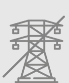
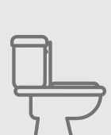
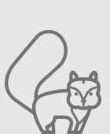

Nos cabanes sont alimentées par panneau solaire pour fournir de la lumière en soirée.

Par contre, il n'y a pas d'électricité dans les cabanes: impossibilité d'utiliser des appareils électriques.  
Vous pouver nous demander de charger vos téléphones à l'accueil.

Chaque cabane est équipée d'une douche ou baignoire et de toilette sèche  
(pour les non-initiés, nous vous dispenserons une formation à votre arrivée)

Votre séjour se déroulera en plein coeur de la forêt avec les alés que cela peut représenter: météo variable, présence d'insectes, oiseaux et autres animaux sauvages à proximité des cabanes.

Merci de vous inscrire sur un créneau d'arrivée (16h-17h-18h ou 19h) et de nous prévenir 24h à l'avance.
