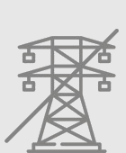
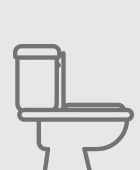
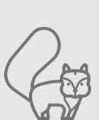

# À savoir avant votre séjour

- 
  _Panneaux solaires_
  Nos cabanes sont alimentées par panneaux solaires pour fournir de la lumière en soirée.

- 
  _Pas d'électricité_
  Il n'y a pas d'électricité dans les cabanes: impossibilité d'utiliser des appareils électriques.  
  Vous pouvez nous demander de charger vos téléphones à l'accueil.

- 
  _Sanitaires_
  Chaque cabane est équipée d'une douche ou baignoire et de toilettes sèches  
  (pour les non-initiés, nous vous dispenserons une formation à votre arrivée)

- 
  _Nature_
  Votre séjour se déroulera en plein coeur de la forêt avec les aléas que cela peut représenter: météo variable, présence d'insectes, oiseaux et autres animaux sauvages à proximité des cabanes.

- 
  _Arrivée_
  Merci de vous inscrire sur un créneau d'arrivée (16h-17h-18h ou 19h) et de nous prévenir 24h à l'avance.
