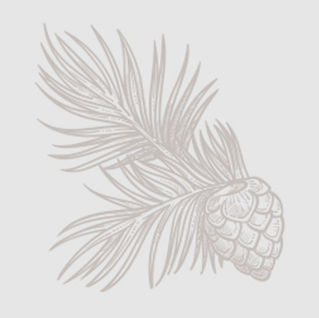

# Pin en Vert 

Véritable nid d’amour forestier, Pin en vert est une cabane cocooning et douillette dans laquelle aiment se retrouver les couples en recherche d’un moment privilégié.

Sa somptueuse terrasse offre un espace parfait de détente, en surplomb de la Dordogne et des magnifiques paysages qui l’entourent.

## Les +

- Terrasse panoramique
- Idéale pour les couples

## Superficie

16m²

## Capacité

Deux personnes
