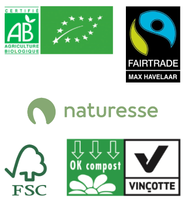

# Philosophie des cabanes

Hêtre sous le Charme un logement éco - responsable qui s'engage à :

- utiliser des essences locales pour la construction de ses cabanes
- utiliser des panneaux solaires pour fournir de l'éclairage
- utiliser des ampoules basse consommation
- isoler ses cabanes avec de la laine de bois et du double-vitrage
- fournir du linge de toilette en coton bio
- utiliser un maximum de produits bio et locaux dans les paniers repas
- utiliser des produits d'entretien bio
- trier ses déchets et faire du compost
- décorer ses cabanes avec des objets provenant de l’artisanat éthique et équitable
- utiliser des toilettes sèches
- préserver la faune et la flore locales
- sensibiliser sa clientèle

[[logos]]
| 
