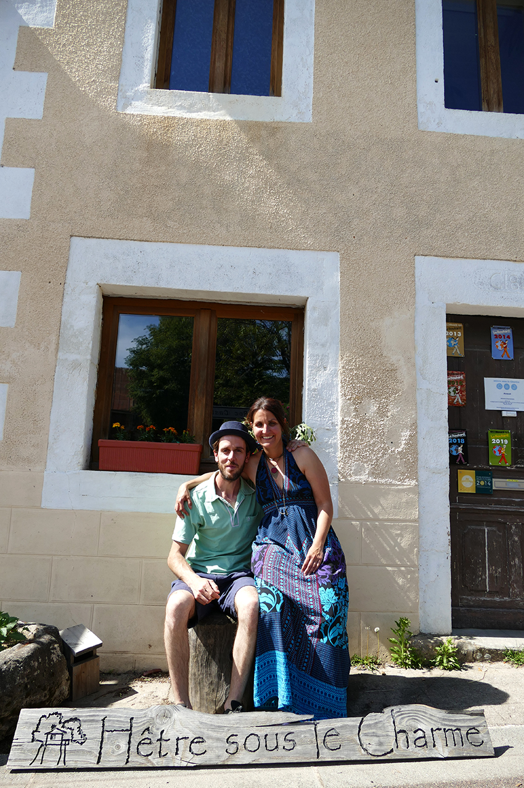

# Présentation

Nous, c’est beaucoup.

C’est deux, ou quatre (ou sept en comptant les doudous), et c’est bien plus si on compte tout.

Nous, c’est Caroline et Clément, corréziens depuis Mai 2019, amoureux depuis bien plus longtemps : amoureux l’un de l’autre, de la nature, de la Corrèze de nos amis, de tellement de choses en fait.

Ce sont ces choses que nous essayons de mettre à l’honneur chez nous, dans notre vie, dans nos cabanes. Des valeurs simples mais vraies, de l’accueil, du goût, de la proximité, de la simplicité la nature, la nature et encore la nature…

Nos prédécesseures, Camille et Julie, avaient déjà placé ces valeurs au centre de leur projet et nous ont fait confiance pour reprendre le flambeau et ajouter notre touche personnelle à ce bel endroit.

Nous serons fiers et heureux de vous accueillir pour vous en faire profiter à votre tour.

Nos quatre cabanes n’attendent que vous, face à la Dordogne, et la surplombant pour un panorama à couper le souffle, le tout au cœur d’un écrin de forêt de 18ha et sur un site protégé Natura 2000.

Et pour vous régaler, venez profiter de petits-déjeuners et paniers repas, cuisinés par nos soins et avec des produits de qualité, en majorité issus de l’agriculture biologique, et approvisionnés chez nos partenaires producteurs régionaux.

Détente, Nature, Bienveillance, Accueil vous attendent, et nous avec.

A très bientôt,

Clément et Caroline
